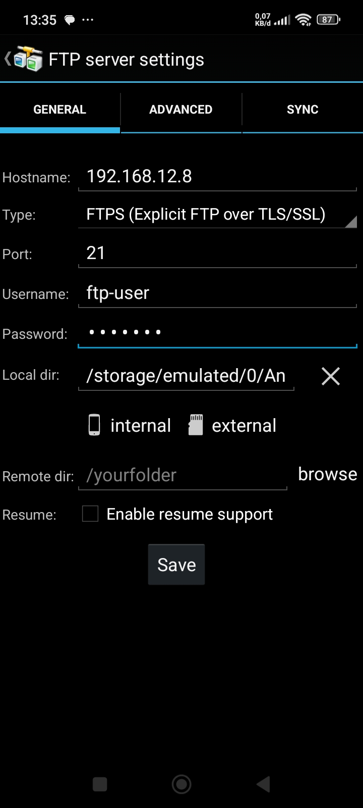

# 📦 Instalasi & Konfigurasi FTP Server dengan vsftpd di Ubuntu VM

Dokumentasi yang mencakup instalasi dan konfigurasi **FTP Server** berbasis **vsftpd** di mesin virtual Ubuntu. Termasuk implementasi fitur keamanan dengan SSL/TLS self-signed, Passive Mode, dan sruktur direktori kolaboratif. Melakukan pengujian melalui perangkat desktop maupun mobile, untuk memastikan bahwa layanan berjalan dengan baik. Kemudian tindakan toubleshooting terhadap error/kesalahan yang di temukan selama proses pengujian.

---

## 🧾 1. Informasi Umum

**Judul Proyek**: Instalasi dan Konfigurasi FTP Server di Ubuntu VM </br >
**Jenis Proyek**: Single Server – Multiple Services

### Lingkungan Pengujian:

* Host OS: Manjaro Linux (Codename: Zetar)
* Guest OS: Ubuntu 24.04.2 LTS
* Virtualisasi: VirtualBox 7.1.8 r168469
* LAN Prefix: `192.168.12.0/24`
* Mode Adapter: Bridged Adapter

### Topologi


---

## 🎯 2. Tujuan

Membangun layanan **FTP Server** menggunakan `vsftpd` dengan konfigurasi keamanan dan kolaborasi tingkat dasar hingga menengah.

### Cakupan:

* Instalasi dan aktivasi `vsftpd`
* Konfigurasi FTP dasar
* Enkripsi koneksi dengan SSL/TLS (FTPS)
* Kolaborasi dengan grup
* Konfigurasi Passive Mode & Firewall
* Pengujian multi-platform
* Troubleshooting

---

## 📚 3. Prasyarat

* Ubuntu 24.04.2 LTS (Guest VM)
* Akses internet & LAN
* Satu user dengan hak akses `sudo`
* FTP Clients:

  * [FileZilla](https://filezilla-project.org/)
  * [AndFTP](https://play.google.com/store/apps/details?id=lysesoft.andftp)

---

## ⚙️ 4. Instalasi FTP Server

### Update & Instalasi vsftpd

```bash
sudo apt update
sudo apt install vsftpd
```

### Cek Status Layanan

```bash
systemctl status vsftpd
```

```yaml
● vsftpd.service - vsftpd FTP server
     Loaded: loaded (/lib/systemd/system/vsftpd.service; enabled; preset: enabled)
     Active: active (running) since Fri 2025-06-06 10:22:45 WIB; 1h 23min ago
       Docs: man:vsftpd(8)
   Main PID: 1098 (vsftpd)
      Tasks: 1 (limit: 4567)
     Memory: 1.4M
        CPU: 24ms
     CGroup: /system.slice/vsftpd.service
             └─1098 /usr/sbin/vsftpd /etc/vsftpd.conf

Jun 06 10:22:45 ubuntu-server systemd[1]: Started vsftpd FTP server.

```
### Backup Konfigurasi Awal

```bash
sudo cp /etc/vsftpd.conf /etc/vsftpd.conf.ori
```

---

## 🧰 5. Konfigurasi Dasar

### Konfigurasi Firewall (Active Mode)

```bash
sudo ufw allow 20,21/tcp
sudo ufw status
```

Penjelasan:

* Port 21: koneksi kontrol
* Port 20: koneksi data (Active Mode)

### Pembuatan Akun FTP

```bash
sudo useradd -N ftp-user
sudo passwd ftp-user
sudo groupadd ftp-group
sudo usermod -aG ftp-group ftp-user
```

### Struktur Direktori FTP

```bash
sudo mkdir -p /srv/ftp
sudo chmod a-w /srv/ftp/
sudo chown nobody:nogroup /srv/ftp/
sudo usermod -d /srv/ftp/ ftp-user
```

### Folder Kolaboratif (Shared)

```bash
sudo mkdir -p /srv/ftp/shared
sudo chown root:ftp-group /srv/ftp/shared/
```

### Uji File Dummy

```bash
cd /srv/ftp/shared/
touch test_ftp.txt
```

---

## 📝 6. Konfigurasi File vsftpd

Edit `/etc/vsftpd.conf` dan tambahkan:

```ini
listen=YES
listen_ipv6=NO
anonymous_enable=NO
local_enable=YES
write_enable=YES
chroot_local_user=YES
```

### Restart Layanan

```bash
sudo systemctl restart vsftpd
```

---

## 📁 7. Struktur Direktori FTP

| Direktori          | Akses                           |
| ------------------ | ------------------------------- |
| `/srv/ftp/`        | Read-only untuk user FTP        |
| `/srv/ftp/shared/` | Read-write untuk grup ftp-group |

---

## 🌐 8. Port & Mode Akses

1. **Port Default**:

   * 21: koneksi kontrol
   * 20: koneksi data (Active Mode)

2. **Passive Mode**:

   * Port data acak, dengan rentang `40000–50000`
   * Perlu diizinkan di firewall

3. **Mode Koneksi**:

   * *Active*: server inisiasi koneksi data
   * *Passive*: client inisiasi koneksi data (lebih aman & stabil)

---

## 🔍 9. Pengujian Koneksi

| Platform | FTP Client |
| -------- | ---------- |
| Desktop  | FileZilla  |
| Android  | AndFTP     |

Pastikan opsi **"Require explicit FTP over TLS"** diaktifkan untuk keamanan.

### Dokumentasi Pengujian:

> Klien desktop berhasil login.


> Buat file baru di dalam direktori FTP Server melalui perangkat klien desktop.


> File baru berhasil dibuat dan tersimpan di dalam direktori FTP Server.


> Login Melalui Perangkat Klien Mobile.



> Klien mobile berhasil login.


> Memantau konektivitas protokol FTP antara server dan klien menggunakan wireshark.


---

## ⚙️ 10. Konfigurasi Tambahan

### Passive Mode

Edit `/etc/vsftpd.conf`:

```ini
pasv_min_port=40000
pasv_max_port=50000
```

Lalu izinkan port di firewall:

```bash
sudo ufw allow 40000:50000/tcp
```

### SetGID pada Folder Shared

```bash
sudo chmod 2775 /srv/ftp/shared/
```

### Whitelist User

```ini
userlist_enable=YES
userlist_file=/etc/vsftpd.userlist
userlist_deny=NO
```

Tambahkan user:

```bash
echo "ftp-user" | sudo tee -a /etc/vsftpd.userlist
```

### Enkripsi SSL/TLS

```bash
sudo openssl req -x509 -nodes -days 365 -newkey rsa:2048 \
-keyout /etc/ssl/private/vsftpd-selfsigned.key \
-out /etc/ssl/certs/vsftpd-selfsigned.crt
```

Tambahkan konfigurasi:

```ini
ssl_enable=YES
allow_anon_ssl=NO
force_local_data_ssl=YES
force_local_logins_ssl=YES
rsa_cert_file=/etc/ssl/certs/vsftpd-selfsigned.crt
rsa_private_key_file=/etc/ssl/private/vsftpd-selfsigned.key
```

---

## 🔒 11. Keamanan

### Isolasi Direktori User

```ini
chroot_local_user=YES
```

### Gunakan Whitelist User

```ini
userlist_enable=YES
userlist_file=/etc/vsftpd.user_list
userlist_deny=NO
```

### Gunakan SSL/TLS

Pastikan koneksi FTP dienkripsi.

### Blokir Akses SSH untuk User FTP

```bash
sudo usermod -s /bin/justftp ftp-user
echo "/bin/justftp" | sudo tee -a /etc/shells
```

Tambahkan ke `/etc/ssh/sshd_config`:

```ini
DenyUsers ftp-user
```

Restart SSH:

```bash
sudo systemctl restart sshd
```

---

## 🧩 12. Troubleshooting

| Masalah                                 | Solusi                                 |
| --------------------------------------- | -------------------------------------- |
| User bisa akses direktori sistem        | Aktifkan `chroot_local_user=YES`       |
| Error "Session reuse required" saat TLS | Tambah `require_ssl_reuse=NO`          |
| Gagal login karena shell                | Tambah `/bin/justftp` ke `/etc/shells` |

---

## 📝 13. Pembelajaran

* Instalasi & konfigurasi `vsftpd`
* Manajemen user & grup
* Firewall & mode FTP
* Troubleshooting & debugging
* Praktik keamanan dasar

---

## 📌 14. Penutup

Dokumentasi ini disusun sebagai:

* Panduan instalasi FTP Server Ubuntu
* Referensi konfigurasi ulang
* Studi kasus keamanan lokal

**Disusun oleh**: Ulil Akbar <br />
**Tanggal**: 06 Juni 2025

---

